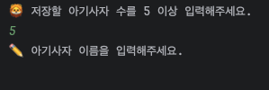
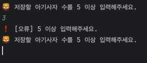
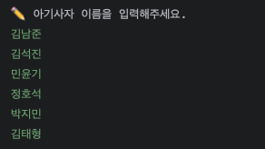
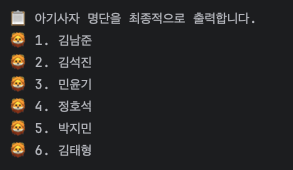
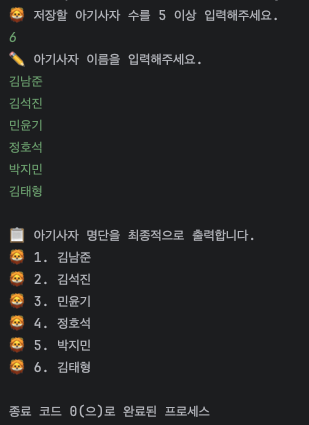

# 1. Java 핵심 문법 & 흐름

## 콘솔 기반 아기 사자 명단 관리 프로그램 데이터 타입, 입출력, 조건, 반복

### 미션 소개

이 미션에서 무엇을 배우고 어떤 경험을 하게 되는지 확인하세요.

> 콘솔로 만드는 아기사자 명단 관리 프로그램 만들기

컴퓨터 프로그램은 사용자로부터 값을 **입력받고,** 그 입력을 처리한 뒤 **결과를 출력하는 흐름**으로 동작합니다. 콘솔 입출력은 이러한 흐름을 자바에서 구현하는 가장 기본적인 방식이며, 모든 애플리케이션의 출발점이 되는 핵심 요소입니다.

이 미션에서는 콘솔 환경에서 **아기사자 명단을 입출력하는 프로그램**을 구현합니다.

먼저 아기사자 수를 입력받고, 그 수만큼 이름을 입력받아 배열에 저장한 뒤, 최종 명단을 콘솔에 출력합니다. 모든 과정은 키보드 입력과 콘솔 출력만을 사용해 진행됩니다.

이 과정을 통해 사용자 입력을 프로그램 내부에서 어떻게 다루는지 이해하고, 배열을 활용해 여러 데이터를 저장하며, 조건문과 반복문을 사용해 **입력 → 처리 → 출력**으로 이어지는 자바 프로그램의 기본 실행 흐름을 직접 구현해봅니다.

---

### 과제 목표

이 미션을 통해 달성해야 할 학습 목표입니다.

- 콘솔 환경에서 **사용자 입력을 받고 결과를 출력하는 전체 흐름**을 설명할 수 있다.

- 사용자로부터 입력받은 값이 프로그램 내부에서 **어떤 순서로 처리되는지** 설명할 수 있다.

- int, String과 같은 **기본 데이터 타입과 참조 타입이 어떤 역할로 사용되는지** 설명할 수 있다.

- 입력받은 숫자 값(int)을 기준으로 **배열의 크기를 결정하는 이유와 방식**을 설명할 수 있다.

- 배열을 사용해 **여러 개의 문자열 데이터를 저장하고 순회하는 구조**를 설명할 수 있다.

- 조건문이 **입력값을 검사하고 프로그램 흐름을 분기하는 역할**을 한다는 점을 이해한다.

- 반복문이 **같은 작업을 여러 번 처리할 때 사용되는 이유**를 설명할 수 있다.

> 목표 수행 시간  
총 소요 시간 : 20시간

---

### 최종 결과물

미션 완료 시 만들어야 할 결과물의 형태입니다.

**아기사자 수를 입력받아, 그 수만큼 아기사자 이름을 저장하고 출력하는 콘솔 기반 명단 관리 프로그램**

1. **아기사자 수 입력**

- 입력/요청
  - 콘솔에서 등록할 아기사자 수를 숫자로 입력한다.

- 출력/화면
  - 입력을 안내하는 메시지가 콘솔에 출력된다.

2. **아기사자 이름 입력 및 저장**

- 입력/요청 
  - 입력한 아기사자 수만큼 이름을 콘솔로 입력한다.

- 처리
  - 입력된 이름은 배열에 순서대로 저장된다.

- 출력/화면
  - 이름 입력을 안내하는 메시지가 콘솔에 출력된다.

3. **최종 아기사자 명단 출력**

- 처리 
  - 배열에 저장된 아기사자 이름을 순서대로 조회한다.

- 출력/화면
  - 최종 아기사자 명단이 콘솔에 출력된다.

`프로그램은 아기사자 수 입력 → 이름 입력 → 명단 출력의 흐름을 한 번 수행한 뒤 종료된다.`

**실행 환경**
- Java 콘솔 환경에서 실행된다.
- 별도의 라이브러리나 프레임워크 없이 Java 기본 문법만 사용하여 구현한다.

---

### 결과 예시

완성된 결과물의 예시입니다. 참고하여 구현해보세요.

**1. 아기사자 수 입력**

- 5 이상 숫자 입력하는 경우 :

- 5 미만 숫자 입력하는 경우 :

**2. 아기사자 이름 입력**

아기사자 수를 6 입력한 경우, 총 6명의 이름을 입력합니다.

**3. 최종 아기사자 명단 출력**

입력한 6명의 명단을 출력합니다.

**4. 전체 콘솔 입출력 흐름**

---

### 제약 사항

미션 수행 시 반드시 지켜야 할 규칙입니다.

- 언어 / 실행 환경
  - Java 콘솔 환경에서 실행되는 프로그램이어야 한다.

- 라이브러리 사용 범위
  - Java 기본 라이브러리만 사용한다.
  - ArrayList와 같은 컬렉션 클래스는 사용하지 않는다.

- 데이터 저장 방식
  - 아기사자 명단은 배열을 사용해 저장해야 한다.

- 프로젝트 구조
  - 단일 Java 애플리케이션으로 구성한다.
  - 패키지 분리나 클래스 분리는 필수 요구사항이 아니다.
  - 사용자 정의 함수(메서드)는 사용하지 않는다.
    - 모든 로직은 main 메서드 내부에서 구현한다.

- 기능 범위
  - 프로그램은 한 번의 실행 흐름만 수행한다.